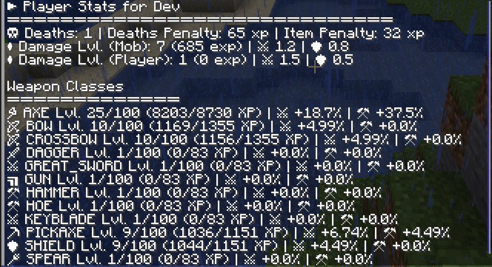
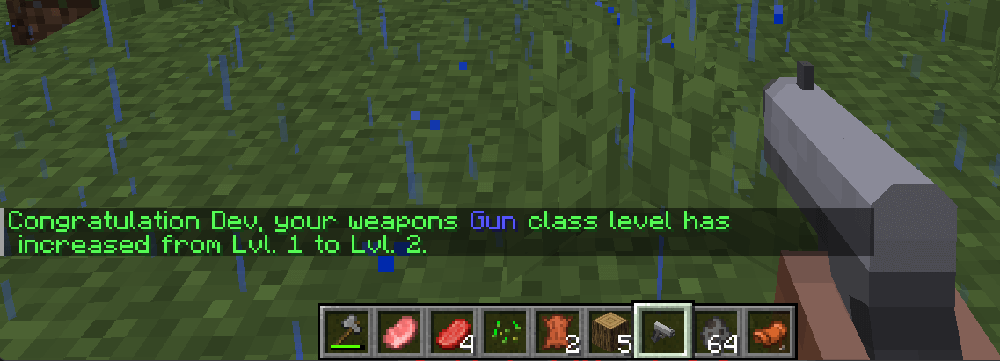
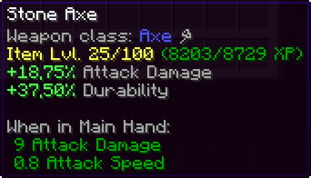
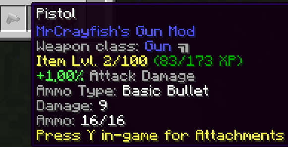

# ⚔️ Dynamic Player Progression and Difficulty (1.18.2)

[](https://www.curseforge.com/minecraft/mc-mods/dynamic-player-progression-and-difficulty)
[](https://www.curseforge.com/minecraft/mc-mods/dynamic-player-progression-and-difficulty)

Dynamically balanced the progression and difficulty for new and experienced player on the same server.
In most cases it's difficult to balanced new players with experience players without frustrating one group.

## ✨ Features

- Dynamically adjust dealt damage (from the Player)
- Dynamically adjust hurt damage (to the Player)
- Dynamically adjust item damage and durability (per Weapon Class)
- Experience points / levels for different kind of areas based on existing stats
- Customization over config file
- Weapon classes with weapon progression (more damage, faster, ...) and mod support
- Use the existing user stats, which mean existing experienced players will start with a higher level and not with level 1.
- Scoreboard (WIP)
- Player specific title (WIP)

## ℹ️ What does the mod do ?

For new players it will increase the dealt damage and decrease hurt damage to the player.
For more experience players it will slight increase the dealt damage per weapon class (over time) and increase the hurt damage to the player for a more challenging experience with additional getting more experience and loot.

With each kill you will earn experience points for a specific areas and weapon classes, which is used to adjust the progression and difficulty per player dynamically.

This means new players will not get killed every few seconds and experience players will get a harder time to kill mobs and need to find new strategies and better equipment.

Depending on your preferred weapons the durability of the items will be also automatically adjusted so that you can play with an axe or even with a hoe.

## 🎱 Commands

The mods has the following commands to get more insights in your stats.

- `/player_progression stats` will provide a overview for the player with their current stats.
- `/player_progression level overview` shows the calculated level and needed experience based on the settings from the configuration. (Op only)

## 🧮 Player Stats

There are different internal stats for the player which are used for the calculations.

There is a build in stats button inside the inventory screen like:


Alternative you can use the `/player_progression stats` command to get an detailed overview.



The stats will not conflict with other mods so you can still use any other RPG or MMO mod.



## ⚔️ Weapon Classes



Each weapon will be categorize in on of the following classes, you can customize them over the config file in the case items are missing from other mods.
Depending on your weapon class the your weapon class level you will get additional bonus stats for the weapon class like additional **Attack Damage** and/or **Durability**.

- 🪓 Axe Class
- 🏹 Bow Class
- ╽╽╽ Claw Class
- ⚔ Claymore Class
- 🏹 Crossbow Class
- 🗡 Dagger Class
- ╽ Fist Class
- ⚔ Great Sword Class
- ▝▜ Gun Class
- ╤ Hammer Class
- ╽ Hand to Hand Class
- ↿ Hoe Class
- ⚔ Katana Class
- ⚷ Keyblade Class
- ╿ Mace Class
- ⚒ Paxel Class
- ⛏ Pickaxe Class
- 🔱 Polearm Class
- ⚳ Scythe Class
- 🛡 Shield Class
- ⚒ Shovel Class
- ╲ Spear Class
- ╲ Staff Class
- ⚔ Sword Class
- ⚔ Tachi Class
- ⚚ Wand Class



## ✔️ Supported Mods

Most of the mods and weapon items should be supported out of the box.
I tested the mod with the following mods:

- Additional Guns
- Age of Weapons
- Axes Are Weapons
- Caves and Katanas
- Cyan Warrior Swords Mod
- Epic Fight
- Epic Knights: Shields, Armor and Weapons
- Four Elemental Swords
- Immersive Engineering
- Keyblades
- Kingdom Keys 2
- MC Dungeons Weaponry
- Tinkers Construct
- Mo' Guns
- MrCrayfish's Gun Mod
- NinjaGear
- OP Scythes
- Old Guns Mod
- RPG style More Weapons!
- Tetra
- Useless Sword
- Weapon Throw
- YDM's Gunblades

If the weapon usage shows up in the stats screen, the mod should be work without any issues.
If the weapon usage is not showing up in the stats screen, you should contact the mod author to get this fixed.

## ❌ Partially supported / Unsupported Mods

Some mods are only partially supported, because their custom items are not implemented the standard stats system correctly.

## 🙋FAQ

### Is this a server side / client side mod❓

Most adjustments happen on the server, but for the next features like the player titles and mini hud the mod is required on the client as well.
You should install it on the server and client to make sure everything works as expected for the players.

### Does it work with xyz❓

The adjustments are prioritized with a LOW priority, which mean every mod with a NORMAL or HIGH priority is able to overwrite or cancel the adjustments. This makes sure it's compatible with other mods with similar features.

### I updated the mod, but something is not working❓

In some cases it could be that I need to adjusted the default values like for additional mod support, better distribution, ...
If you run into any issue, please try first to delete the existing `config/dynamic_player_progression_and_player_difficulty-common.toml` file and restart the client / server.
After the restart the file should be automatically re-crated with the correct default values.

## 🖩 Calculations

This sections give a short overview how the different experience are calculated.

```math
Damage Experience Mob = (Damage Dealt * (Mob Kills / Damage Base)) - (Player Deaths * Experience Death Penalty)
```

```math
Damage Experience Player = (Damage Dealt * (Player Kills / Damage Base)) - (Player Deaths * Experience Death Penalty)
```

```math
Item Experience = (Item Used * Item Experience Factor) - (Player Deaths * Item Experience Death Penalty)
```

## Adjustments

### Player Adjustments

The player adjustment happing with the `EventPriority.LOW` priority, which mean they will be added before any weapon adjustments of the calculation chain and could be canceled by any other mod with a higher priority.

### Weapon Adjustments

The weapon adjustment happing with the `EventPriority.LOWEST` priority, which mean they will be added at the end of the calculation chain and could be canceled by any other mod with a higher priority.

## Version Status Overview 🛠️

| Version        | Status                |
| -------------- | --------------------- |
| Fabric Version | ❌ Not planned        |
| Forge 1.16.5   | ❌ Not planned        |
| Forge 1.17.1   | ❌ Not planned        |
| Forge 1.18.1   | ❌ Not planned        |
| Forge 1.18.2   | ✔️ Active development |
| Forge 1.19     | ⚠️ Deprecated         |
| Forge 1.19.1   | ⚠️ Deprecated         |
| Forge 1.19.2   | ✔️ Active development |

## License

The MIT [LICENSE.md](LICENSE.md) applies only to the code in this repository. Images, models and other assets are explicitly excluded.
